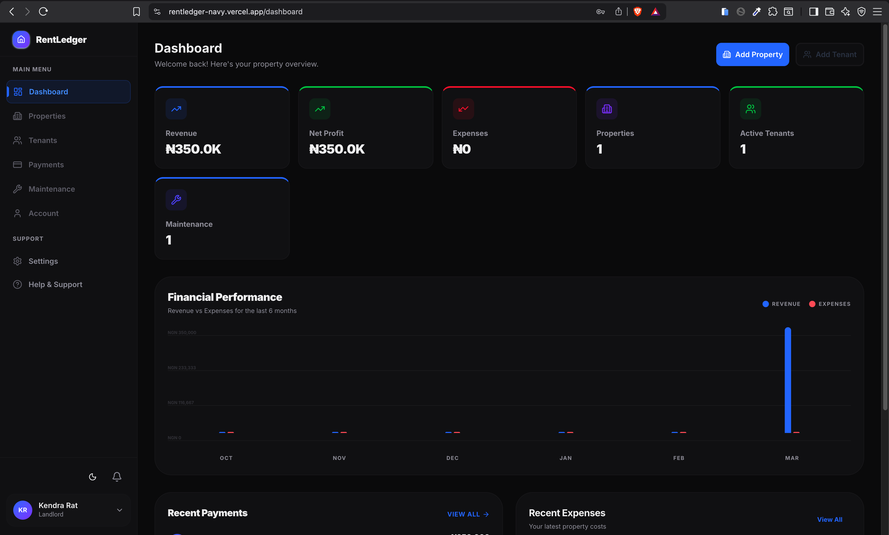
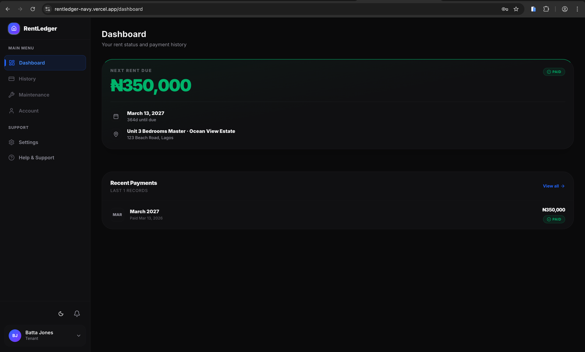

# RentLedger

A modern rent management platform built with Next.js and Supabase that helps landlords track properties, tenants, and payments while giving tenants clear visibility into their rent status.

## About RentLedger

RentLedger simplifies rent management by replacing manual tracking (notebooks, WhatsApp chats, Excel sheets) with structured dashboards and automated payment tracking.

## Screenshots

### Landlord



### Tenant



**Problem Solved:**

- Landlords forget who has paid
- Tenants forget due dates
- No clear record of outstanding balances
- Manual tracking causes conflicts and stress

**Solution:**

- Automated rent payment monitoring
- Clear dashboards showing who paid and who hasn't
- Overdue payment tracking
- Role-based access for landlords and tenants

## Tech Stack

- **Frontend:** Next.js 16 (App Router), React 19, Tailwind CSS
- **Backend:** Supabase (Auth + PostgreSQL)
- **Database:** PostgreSQL with Row-Level Security (RLS)
- **Deployment:** Vercel

## Getting Started

### Prerequisites

- Node.js 18+
- pnpm (recommended)
- Supabase project

### Installation

```bash
# Clone the repository
git clone <repository-url>

# Install dependencies
pnpm install

# Set up environment variables
# Create .env.local with your Supabase credentials
cp .env.example .env.local

# Run the development server
pnpm dev
```

Open [http://localhost:3000](http://localhost:3000) to view the app.

### Environment Variables

```
NEXT_PUBLIC_SUPABASE_URL=your_supabase_url
NEXT_PUBLIC_SUPABASE_ANON_KEY=your_supabase_anon_key
```

## Features

### Landlord Features

- Create and manage properties
- Add units inside properties
- Assign tenants to units
- Generate monthly rent records
- Verify/reject payment submissions
- View revenue, pending, and overdue payments

### Tenant Features

- View assigned unit and rent amount
- See next due date and overdue status
- View payment history
- Submit payment proof

### Smart Logic

- Automatic overdue status calculation
- Dashboard auto-calculations
- One active tenancy per tenant

## Database Schema

- **profiles** - User roles and profiles
- **properties** - Landlord's properties
- **units** - Units inside properties
- **tenancies** - Tenant assignments to units
- **payments** - Payment records

## Project Structure

```
src/
├── app/                    # Next.js App Router pages
│   ├── (dashboard)/        # Protected dashboard routes
│   ├── api/               # API routes
│   └── auth/              # Authentication pages
├── components/             # React components
├── hooks/                 # React Query hooks
├── lib/                   # Utilities and helpers
├── services/              # Business logic services
└── types/                 # TypeScript types
```

## Security

- Supabase Auth for user authentication
- Row-Level Security (RLS) policies
- Foreign key constraints
- Enum validation

## License

MIT
